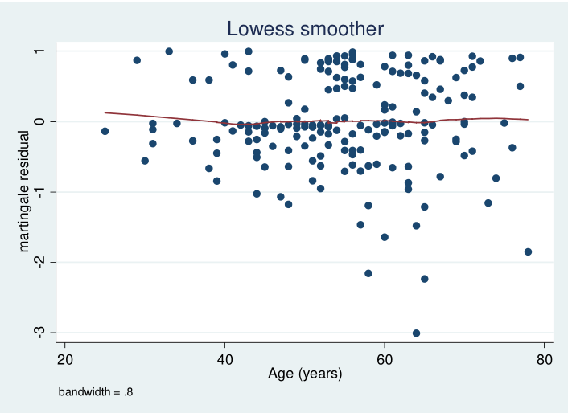

```{r setup, include=FALSE}
options(htmltools.dir.version = FALSE)
```

# Describing survival data (1)

<!-- ### Important assumptions:  -->

<!-- + It is assumed that censoring is uninformative about event times. -->

<!-- + This means that the time at which an individual is censored, or the fact that they are censored, does not give us any information about when that person may have the event. -->

+ We define a random variable $T$, which represents survival time.

+ The survival function 

    + The survivor function at a time $t$ is the probability that the survival time $T$ exceeds a value $t$:

$$S(t) = \text{Pr}(T>t)$$
  + Relation to the cumulative distribution function: 
    
$$
\begin{aligned}
F(t) & =  \text{Pr}(T\leqslant t) \\
     & = 1 - \text{Pr}(T>t) \\ 
     & = 1- S(t)
\end{aligned}
$$

+ The hazard function

$$
h(t) = \text{lim}_{\delta\rightarrow0}\frac{1}{\delta}\text{Pr}(t\leqslant T < t + \delta | T \geqslant t)
$$


---
class: middle

# Describing survival data (2)

- The cumulative hazard function

$$
H(t) = \int_o^th(u)du
$$


- The probability density function at time $t$:

$$
f(t) = \frac{d}{dt}F(t) = \text{lim}_{\delta\rightarrow0}\frac{1}{\delta}\text{Pr}(t\leqslant T < t + \delta)
$$
- In general, and in particular to incorporate continuous variables and adjustment for confounders, we want to use
**regression-based approaches** to analyze survival data. 

- Methods of analysis need to **handle censoring** and need to allow for the fact that **survival times are strictly non-negative**.


---
class: middle

### Relationships between functions (1)

<!-- ## $S(t), h(t), H(t), f(t)$ -->

$$
\begin{aligned}
f(t) & = \frac{\text{d}}{\text{d}t}F(t)  = \frac{\text{d}}{\text{d}t}\{ 1-S(t) \} = - \frac{\text{d}}{\text{d}t}S(t) \\
S(t) & = 1 - F(t)  = 1 - \int_0^t f(u)\text{d}u = \int_t^\infty f(u)\text{d}u \\
h(t) & = \lim_{\delta\rightarrow0}\frac{1}{\delta}\text{Pr}(t \leqslant T < t+ \delta | T > t) \\
     & = \lim_{\delta\rightarrow0}\frac{1}{\delta}\frac{\text{Pr}(t \leqslant T < t+ \delta, T > t)}{\text{Pr}(T > t)} (\text{Bayes' Theroem}) \\
     & = \lim_{\delta\rightarrow0}\frac{1}{\delta}\frac{\text{Pr}(t \leqslant T < t+ \delta)}{\text{Pr}(T > t)} = \frac{f(t)}{S(t)}\\
h(t) & = \frac{f(t)}{S(t)} = \frac{\frac{\text{d}}{\text{d}t}F(t)}{S(t)}  \\
     & = \frac{- \frac{\text{d}}{\text{d}t}S(t)}{S(t)} = -\frac{d\log[S(t)]}{dS(t)}\cdot\frac{dS(t)}{dt}  \\ 
     & = - \frac{\text{d}}{\text{d}t}\text{log}[S(t)] (\text{chain rule}) \\
\end{aligned}
$$


---
class: middle

### Relationships between functions (2)

$$
\begin{aligned}
H(t) &  = \int_0^th(u)du = \int_0^t\frac{f(u)}{S(u)}du = \int_0^t\frac{f(u)}{1-F(u)}du  \\
     & = - \int_0^t\frac{-f(u)}{1-F(u)}du = - \log[1-F(t)] = -\log[S(t)] \\ 
\Rightarrow S(t) & = \exp[-H(t)]
\end{aligned}
$$


---
class: middle
# Analysing survival data

### 1. Fully parametric methods
- Exponential distribution
- Weibull distribution
- Log-logistic distribution

### 2. Non-parametric methods 
- Kaplan-Meier estimate of the survivor function
- Life table estimates
- Log rank test
- Nelson-Aalen estimate of the cumulative hazard

### 3. Semi-parametric methods
- Cox proportional hazards model

---
class: middle
# Parametric models (1)

**Exponential distribution:** Under the exponential distribution the hazard rate is constant over time: $\lambda$

$$
\begin{aligned}
h(t) & = \lambda \\
S(t) & = \exp(-\lambda t) \\
f(t) & = \lambda\exp(-\lambda t) \\
\end{aligned}
$$
*Proportional hazard model:*
$$h(t|x) = h_0(t)\exp(\beta x) = \lambda \exp(\beta x)$$

**Weibull Distribution:**

$$
\begin{aligned}
h(t) & = \lambda\kappa t^{\kappa - 1} \\ 
S(t) & = \exp(-\lambda t^\kappa) \\ 
f(t) & = \lambda\kappa t^{\kappa - 1}\exp(-\lambda t^\kappa)
\end{aligned}
$$

*Proportional hazard model:*

$$h(t|x) = h_0(t)\exp(\beta x) = \lambda\kappa t^{\kappa - 1} \exp(\beta x)$$

---
class: middle
# Parametric models (2)


- The assumption that $\beta$ does not depend on $t$ is called the **proportional hazards assumption** -- the effect on the hazard does not change over time.

- The ratio of the hazards in the two groups is called: **Hazard ratio**
$$
\frac{h(t|x)}{h_0(t)} = \exp(\beta)
$$

- $\beta$ is called log hazard ratio

- The hazard ratio $\exp(\beta)$ does not depend on time (the **proportional hazards assumption**) -- it is **constant** over time .


---
class: middle
### Fitting Parametric models in STATA and R

- STATA: after `stset` declared

```
streg exp_var, d(exp)
streg exp_var, d(weib)

// comparing exponential and weibull distribution
qui streg exp_var, d(weib)
qui estimates store A
qui streg exp_var, d(exp)
qui estimates store B
lrtest A B, force
```

- R: 

```{r eval=FALSE}
expo00 <- survival::survreg(Surv(time, event)) ~ exp_var, 
                                   dist = "exponential", data)
expo01 <- survival::survreg(Surv(time, event)) ~ exp_var, 
                                   dist = "weibull", data)

anova(expo00, expo01) # likelihood ratio test
```


---
class: middle
# Semi-parametric model (1)

Form of a proportional hazard model:

$$
h(t|x) = h_0(t)\exp(\beta x)
$$

In fully parametric survival models (exponential distribution model, Weibull distribution model, etc.), a form is assumed for $h_0(t)$ (baseline hazard).

We have to specify a form for the baseline hazard in fully parametric survival models, which we may make mistakes.

But, 

--

- If the hazard ratio $\exp(\beta)$ is the only parameter of interest. 

--
- **Do we really care about the baseline hazard** $h_0(t)$ ?


---
class: inverse
background-image: url("./img/Idontcare.jpg")
background-position: 50% 50%
background-size: contain


---
class: middle
# Semi-parametric model (2)

- Cox (1972) <sup>1</sup> suggested that the baseline hazard could be left un-specified.

- The model for the hazard of the form is called **Cox proportional hazards model** if no form is given for the baseline hazard. 

$$
h(t|x) = h_0(t)\exp(\beta x) 
$$

- This is a **semi-parametric model** because the effect (hazard ratio) of explanatory variable $x$ on the hazard is parameterized, but $h_0(t)$ (baseline hazard) is not parameterized. 


.footnote[
[1] Cox, David R. 1972. “Models and Life-Tables Regression.” JR Stat. Soc. Ser. B 34: 187–220.]

---
class: middle
# To be semi-parametric or fully-parametric?

- The Cox model uses fewer assumptions, but a fully parametric model may **often be perfectly appropriate**.

- If an exponential or Weibull model is fine, then a Cox model is also OK.

- They will generate similar hazard ratio estimates. 

- The fully-parametric approach may give slightly more precise (smaller 95% CIs).

- But this is traded off against the concern that the baseline hazard may have been mis-specified.


---
class: inverse, middle, center
# What are we assuming?

---
class: middle
# Assumptions

1. **The proportional hazards assumption** that the explanatory variables act on survival in such a way that the hazard ratio is constant over time: $h(t|x) = h_0(t)\exp(\beta x)$ is correct.

2. The assumption that we have **correctly specified the form** for how the explanatory variables act on the hazard: $h(t|x) = h_0(t)\exp(\beta x) \text{ versus } h(t|x) = h_0(t)\exp(\beta_1 x + \beta_2 x^2)$.

3. Censoring is **uninformative** for the event of interest.

4. Individuals are **independent**.

5. We have included **all relevant** explanatory variables **including possible interactions**.


---
class: middle
### Assessing the proportional hazards assumption (plot)

- The survivor function: 

$$
S(t|x) = \exp[-H_0(t)e^{\beta x}]
$$

- Take logs and moving the minus sign: 
$$
-\log S(t|x) = H_0(t)e^{\beta x}
$$

- Take logs again: 
$$
\log[-\log S(t|x)] = \log H_0(t) + \beta x
$$


- If $x$ is a binary (0 or 1) variable, then if we plot $\log[-\log S(t|0)]$ and $\log[-\log S(t|1)]$ against **time (or other function of time, such as log time)**, the curves for different groups should be approximately **parallel over time** if the proportional hazards assumption is met. 


---
class: middle
### Assessing the proportional hazards assumption (plot)

- In Stata, this can be easily done by the following command after `stset` survival data:

```
stphplot, by(treat)
```

- In R, a little bit working

```{r, eval=FALSE}
survfit_object <- survfit(Surv(time, event) ~ treat, data)
plot(survfit_object, fun = "cloglog", xlab = "time(logcale)", 
   ylab = "log(-logS(t))")
```

```{r echo=FALSE, out.width='70%', fig.align='center'}

```

---
class: inverse, center, middle
# Strategies of doing survival analysis


---
class: middle, center
## The strategy of analysis depends on the **type of study** and on the **question of interest**

#### Experimental (randomized controlled trial) or Observational study

---
class: middle
# Randomized controlled trial

- Treatment group and a control group

- No other variables of interest except for treatment


---
class: middle
## Proposed strategy: 
1. Summarise
    1. The numbers of individuals in the two treatment groups
    2. The numbers of events and censorings in the two treatment groups
    3. median event and consoring times in the two treatment groups.
2. Present Kaplan-Meier estimates of the survivor curves.

3. Use the log rank test to assess the null hypothesis that the survivor curves in the two treatment groups are the same. 

4. Investigate using plots whether a proportional hazard assumption is appropriate in quantifying the association between treatment groups and survival.

5. If PH assumption is appropriate, fit Cox PH model (or exponential/Weibull, etc.) to estimate: hazard ratio, p value, and 95% CI.
6. Perform more formal assessments (tests) about the PH assumption

---
class: middle
# Observational studies

- Several explanatory variables that we need to consider. 
- The choice of explanatory variables to be included in a survival model depends on the aims of your investigation: 

  - Type 1: **Estimating an exposure effect** <br> We are only interested in mainly one particular exposure, but wish to control for possible confounders
  
  - Type 2: **Understanding the associations between a set of several variables and the time-to-event** <br> We are interested in the independent effects of several exposures on survival, perhaps to determine which has the greatest impact on survival.
  
  - Type 3: **Prediction modelling** <br> We wish to use a potentially large number of explanatory variables to build a model from which we can predict survival in a new individual with given values for the explanatory variables. 


---
class: middle, center, inverse
## Estimating an exposure effect


---
class: middle
## Proposed strategy - preliminary investigations: 

- All analyses should start with preliminary investigations

  - Kaplan-Meier plots and log rank tests to investigate the association between **each variable and the outcome**.
  
  - Assessments of proportional hazard assumption for each variable using plots. 
  
  - Investigate the association between the **main exposure and each potential confounder**.
  
  
---
class: middle
## Proposed strategy - main analysis: 

1. Fit a survival model using only the main exposure of interest.

2. Fit further models including the main exposure and each potential confounder, **one at a time**.

3. Examine the impact of adjustment for **each confounder** on the estimated association (the HR) between the main exposure and time-to-event.

4. Assess whether there is evidence that any of the adjustment variables modify the effect of the main exposure, i.e. whether there are any interactions (gender, etc.).

5. Fit a model for the main exposure with adjustment for variables identified as confounder in stage 3, and with interaction identified in 4.

6. For any remaining variable not included in the model in 5., add them back to the model **one by one** to assess whether they are confounders in the presence of any of the other variables in the model. 

7. For the final model, include all variables used in 5. plus any additional variables identified in 6.

---
class: middle, center
## **Further check:** 

## Again, check whether the proportional hazard assumptions holds in the final model.


---
class: middle 
### Understanding the associations between a set of several variables and the time-to-event

- Here we may not have much prior hypotheses about which explanatory variable(s) may be associated with survival.

- If there are not too many variables then we might decide to include them all in a model and discuss the associations between each variable and the outcome after adjustment for all other variables.

- Alternatively, one might follow a procedure which is an extended version of that for investigation type 1.

---
class: middle 
### Proposed strategy 

#### Preliminary investigations
- Kaplan-Meier plots

- Log rank tests to investigate the association between each variable and the outcome.

#### Main analysis
- As outlined in Collet (2015)<sup>1</sup> and as described in the following slides.

```{r echo=FALSE, out.width='18%', fig.align='right'}

```

.footnote[
[1] Collett, D. Modelling survival data in medical research.<br>
Chapman and Hall/CRC, 2015]

---
class: middle
### Proposed strategy - main analysis: 

1. Consider each variable separately in a series of Cox proportional hazards (or parametric) models and assess whether each is associated with survival by itself using a likelihood ratio test (LRT, next slide). 

2. Include all of the variables selected at stage 1. in a single Cox proportional hazards model. 

3. Exclude each variable one by one and use LRT to assess whether the exclusion significantly reduces the log likelihood. 

4. Based on the results from this procedure, take those variables which remain independently associated with survival through to next stage. 

5. Variables which are not important on their own could become important in the presence of (conditonal on) other variables. For each variable that did not make it through to stage 2., enter them back into the model from stage 2. **one by one** and check whether adding any of them would improve the fitting of the model. (Again, use LRT)

6. Check and make sure that there is no variable left in the model which could be omitted (based on LRT), and that there are no excluded variables which should be added (based on LRT)

---
class: middle
### **What is likelihood ratio test (LRT):** 

- LRT can be used to compare nested Cox proportional hazards models (or other parametric models)

- The basic principle: let's consider two variables $x_1, x_2$, where $x_1$ is of interest, and $x_2$ is potential confounder: 

    - Fit the survival model (Cox/exponential/Weibull) **with and without** inclusion of $x_2$; 
    - If the inclusion of $x_2$ changes the HR of $x_1$ **significantly**, then we will retain it in the model;
    - If the inclusion of $x_2$ has **little impact** on the HR of $x_1$ estimated, and is not of interest then we may decide to omit it from the model;
    - If there are many potential confounders, each could be assessed in turn (one by one).

---
class: middle
### **What is likelihood ratio test (LRT) testing:** 

If Model 1 is nested within Model 2 then the likelihood ratio test statistic is: 

$$-2(\ell_{\text{Model 1}} - \ell_{\text{Model 2}}) \sim \chi^2_p$$

Where 

- $\ell$: log-likelihoods under the two models
- $p$: difference in the number of parameters in the two models
- Possible interactions between $x_1, x_2$ should be considered
- functional forms for the variables should also be considered (i.e. should we include a $x_1^2$?)
- LRT cannot be used to compare a parametric model (exponential/Weibull) with a Cox proportional hazards model, because they are not nested.

---
class: middle
### Proposed strategy - main analysis: 

1. Consider each variable separately in a series of Cox proportional hazards (or parametric) models and assess whether each is associated with survival by itsefl using a likelihood ratio test (LRT, next slide). 

2. Include all of the variables selected at stage 1. in a single Cox proportional hazards model. 

3. Exclude each variable one by one and use LRT to assess whether the exclusion significantly reduces the log likelihood. 

4. Based on the results from this procedure, take those variables which remain independently associated with survival through to next stage. 

5. Variables which are not important on their own could become important in the presence of (conditonal on) other variables. For each variable that did not make it through to stage 2., enter them back into the model from stage 2. **one by one** and check whether adding any of them would improve the fitting of the model. (Again, use LRT)

6. Check and make sure that there is no variable left in the model which could be omitted (based on LRT), and that there are no excluded variables which should be added (based on LRT)

---
class: middle, center
## **Further check:** 

## Again, check whether the proportional hazard assumptions holds in the final model.


---
class: middle, inverse, center
## Model checking


---
class: middle
## Model checking (1)

Before reporting results, we should check that the fitted model is **correctly specified**.<br>
If not, inferences could be invalid and incorrect conclusions could be drawn on the research question of interest. 

- Three main ways of assessing whether the proportional hazards assumption is reasonable. 
      - Non-parametric plots as introduced. 
      - Test of whether the effect (HR) of the explanatory variables on the hazard depends on time. 
      - Plots of special residuals: Schoenfeld residuals.
      
- **Model checking is more than checking the proportional hazard assumption.**
      - Is there any individual might be extreme or the model does not provide a good fit?
      - Is the functional form for the explanatory variables correct? (More and more residuals coming)

---
class: middle
### **The proportional hazard assumption (1)**

- The effect (HR) of the explanatory variables on the hazard is the same over time.

- Pay attention in situations such as: explanatory variable has strong effect at the start of the time scale but weaker effect later on. 

- The above situation is a violation of the proportional hazards model. 


---
class: middle
### **The proportional hazard assumption (2)**

Test whether effect of explanatory variable on the hazard changes over time. 

This can be done by including an interaction between time and the explanatory variable in the model: 

$$
h(t|x) = h_0(t)\exp(\beta x + \gamma (x\times t))
$$

If effect of $x$ on the hazard changes over time then the parameter $\gamma$ will be significantly different from zero.

Which means to perform a test with the null hypothesis that $\gamma = 0$ using: 

- Likelihood ratio test
- Wald test: $\frac{\hat\gamma}{SE(\hat\gamma)} \sim N(0,1)$

For several explanatory variables then include interactions with time for each variable.

---
class: middle
### **The proportional hazard assumption (3)**

Using **Schoenfeld residuals**

$$r_{S_{1j}} = x_1i_j - \frac{\sum_{k\in R_j} x_{1k}\exp\hat\beta^Tx_k}{\sum_{k\in R_j }\exp\hat\beta^Tx_k}$$

1. The sum of Schoenfeld residuals should sum up to zero (or very close).

2. Schoenfeld residuals should not show any association (dependence) with time -> proportional hazards assumption is met.


---
class: middle
### **The proportional hazard assumption (3)**

Using **Scaled Schoenfeld residuals** is more convenient:

$$r_{SS_{1j}} = d\times r_{S_{1j}}\text{var}(\hat{\beta_1})$$

In STATA: 

```
stcox cir0
estat phtest, plot(cir0)
```

```{r echo=FALSE, out.width='50%', fig.align='center'}
knitr::include_graphics('img/Schoenfeld.png')
```

---
class: middle
### **The proportional hazard assumption (4)**

In STATA:

```
stcox cir0 
estat phtest 

Test of proportional-hazards assumption
Time: Time
----------------------------------------------------------------
            |   chi2    df                             Prob>chi2
------------+---------------------------------------------------
global test |   2.52     1                                0.1124
----------------------------------------------------------------
```

In R: 

```{r eval=FALSE}
time.dep.zph <- survival::cox.zph(cir0.cox, transform = "identity")
plot(time.dep.zph)
time.dep.zph
```

```
#         rho   chisq     p
# cir0 -0.169    2.53  0.112
```

---
class: middle
### **Assessing the correct functional form of continuous variables (1)**

Using **Martingale residuals** to help us choose the correct form of continuous variables.

Sometimes continuous variables need to be transformed or may be need to be added into the model in a quadratic/cubic form, in order to meet the proportional hazard assumption:

$$
\begin{aligned}
h(t|x) & = h_0\exp(\beta x) \\ &\text{ vs } \\ 
h(t|x) & = h_0\exp(\beta \log x) \\ &\text{ vs } \\ 
h(t|x) & = h_0\exp(\beta_1 x + \beta_2 x^2) \\ &\text{ vs } \\ 
h(t|x) & = h_0\exp(\beta_1 x + \beta_2 x^2 + \beta_3 x^3)
\end{aligned}
$$

---
class: middle
### **Assessing the correct functional form of continuous variables (2)**

Martingale residuals: 

- a residual for an event process

- Difference between what happened (observed) to a person (whether they had the event or not) and what is predicted to happen to a person under the model that has been fitted.

For individual $i$, his/her Martingale residual is defined as: 

$$r_{Mi} = \delta_i - \hat H_0(t_i)\exp (\hat\beta x_i)$$


- $\delta_i$: event indicator [event = 1, censored = (0)]

- $t_i$: event or censoring time; $x_i$: explanatory variable

- $\hat H_0$: estimated baseline cumulative hazard at time $t_i$

**If the model is correct then the Martingale residuals should sum to 0 (or close).**


---
class: middle
### **Assessing the correct functional form of continuous variables (3)**

- A plot of the Martingale residuals $r_{Mi}$ from a null model vs a continuous variable that we are interested in entering into the model can be used to indicate the appropriate functional form when it is entered in the model. 

- If there are binary and categorical variables we know (after the variable selection procedure) that will be included in the model, then we could include these in the model and obtain the Martingale residuals, instead of using the null model.


---
class: middle
### **Assessing the correct functional form of continuous variables (4)**

<!--   -->
<!--   -->

In STATA

```
stcox treat cir0 log_bil0 cenc0, estimate 
predict mgale_res_age, mgale
lowess mgale_res age
// The resulting plot is given here, and there 
// is some suggestion that there is a non-linear effect of age
```

```{r echo=FALSE, out.width='65%', fig.align='center'}

```


---
class: middle
### **Assessing the correct functional form of continuous variables (5)**

A simple possibility is that we need to add a **quadratic term for age**. The new plot (below) looks better -- the lowess plot is approximately a flat line.

```
gen agesq = age^2
stcox treat cir0 log_bi10 cenc0 age age sq, estimate 
predict mgale_res_2, mgale
lowess mgale_res_2 age
```
```{r echo=FALSE, out.width='65%', fig.align='center'}

```


---
class: middle
### **Assessing the correct functional form of continuous variables (6)**

In R: 

```{r eval=FALSE}
model.cox <- survival::coxph(Surv(time, event) ~ treat + cir0 
                             + log_bil0 + cenc0, data)
mgale_res <- resid(model.cox, type = "martingale")
plot(age, mgale_res)
lines(lowess(age, mgale_res))

model.cox1 <- survival::coxph(Surv(time, event) ~ treat + cir0 
                             + log_bil0 + cenc0 + age + 
*                              I(age^2), data)
mgale_res <- resid(model.cox1, type = "martingale")
plot(age, mgale_res)
lines(lowess(age, mgale_res))
```

---
class: middle
### **Identifying outliers (1)**

**Deviance residuals** are a transformation of the Martingale residuals and are defined as

$$r_{D_i} = sign(r_{M_i})[-2(r_{M_i} + \delta_i\log(\delta_i - r_{M_i}))]^{1/2}$$

- The deviance residuals transform the Martingale residuals so that they are **symmetrically distributed around the line at zero**.

- A large deviance residual indicates the model does not fit well for that individual 

    - **Large positive** deviance residual suggests that the individual has the event sooner than predicted by the model; 
    - **Large negative** deviance residual suggests that the individual had the event later than predicted by the model.
    
    
---
class: middle
### **Identifying outliers (2)**


Plot deviance residuals against risk score $(\beta^{Tx})$: if individuals with a high risk score tend to have higher deviance residuals, this might indicates that the model provides worse fit for this type of individuals.

After assessing the residuals we must consider what to do about people found with worse fitting: 

- Investigate their features -- Do they have particular features?

- Any additional variables included can improve the fitting?

- Any variable needs to be transformed to other forms so that fitting could be improved?


---
class: middle
### **Identifying outliers (3)**

In STATA 

```
stset dateout, origin(datein) id(id) fail(d) scale(365.25)
// cox model of interest
stcox ag log_wbc 
// deviance residuals, plotted by individual
predict dev, deviance
gen num=_n
scatter dev num
// deviance residuals plotted against risk score
predict riskscore, xb
scatter dev riskscore
```

```{r echo=FALSE, out.width='50%', fig.align='center'}

```


---
class: middle
### **Identifying outliers (4)**

In R

```{r eval=FALSE}
cox.model <- survival::coxph(Surv(time, status) ~ sex, data = lung)
# extract the deviance residuals
devres <- resid(cox.model, type = "deviance")

# plot against individuals
plot(devres, xlab = "index", ylab = "Deviance Residuals", cex.lab = 1.3) 
abline(h=0)

# plot against risk scores (linear predictors)
lp <- predict(cox.model, 
              type="lp" ) # extract risk scores for each individual
plot(lp, devres, xlab = "Linear Predictors", 
                 ylab = "Deviance Residuals", cex.lab = 1.3) 
abline(h=0)
```

---
class: middle
### **Other residuals**


- **Delta-beta**
    1. Remove individual $i$ from the data and fit the model again, find an estiamte of log hazard ratio parameter: $\hat\beta_{1(i)}$
    2. The difference between the estimate using the full data $\hat\beta_1$ and the estimate with individual removed: $\hat\beta_1 - \hat\beta_{1(i)}$
    3. Large delta-beta occurs if individual $i$ has a large influence on the estimate from the full data
    4. Plots of delta-betas for all individuals can identify individuals who might have a large influence on the overall estimate.

In Stata: 
```
predict double dfb*, dfbeta
scatter dfb* num
```
```{r echo=FALSE, out.width='40%', fig.align='center'}

```


---
class: middle
### **Incorporating model checking into the strategy for analysis**

- Developing an analysis strategy is a **complex task**.

- In survival analysis there is the additional complexity that we should check the proportional hazards assumption 

So what can we do if we find evidence that the proportional hazards assumption does not hold?

- Changing the functional form of the explanatory variables

- Fitting separate models in different parts of the time scale

- Using a stratified Cox proportional hazards model

- Abandon using proportional hazards model (use other types of model that does not require the assumption, such as accelerated failure time, AFT model)

  
---
class: middle
### **Stratified Cox proportional hazards model (1)**


Stantdard Cox proportional hazards model:

$$h(t|\text{Sex, Treat}) = h_0(t)[\exp{\beta_{\text{sex}}\text{Sex} +\beta_{\text{treat}}\text{Treat}}]$$

Cox proportional hazards model **stratified by sex**: 


$$h(t|\text{Sex, Treat}) = \left\{\begin{array}{ll} h_{0M}(t)\exp(\beta_{\text{treat}}\text{Treat}) \text{ for men} \\ h_{0F}(t)\exp(\beta_{\text{treat}}\text{Treat}) \text{ for women}  \\ \end{array}\right.$$

Where
- The effect of the treatment is assumed to be the same for men and women $(\beta_{\text{treat}})$ and is assumed to act proportionally on the hazard
- But women and men have a different baseline hazard, **i.e. the effect of sex is not assumed to be proportional.**

---
class: middle
### **Stratified Cox proportional hazards model (2)**

- Each case, at it's event time, is compared with all individuals **at risk in the same stratum as the case.** 

```{r echo=FALSE, out.width='80%', fig.align='center'}


```


---
class: middle, inverse, center
# Accelerated failure time models

---
class: middle
### **Accelerated failure time model (1)**


--

- Did we forget about something?

--
- Do you really care about the hazard $h_0(t)$?

--
<iframe src="https://giphy.com/embed/OJaBv8p3xWUoM" width="480" height="270" frameBorder="0" class="giphy-embed" allowFullScreen class="center"></iframe><p><a href="https://giphy.com/gifs/OJaBv8p3xWUoM"></a></p>


--
- Is there a way that we can **model the impact of explanatory variables on the event time itself?**


---
class: middle
### **Accelerated failure time model (2)**

$T_0$ event time in the control group

$T_1$ event time in the treatment group

$$T_1 = \psi_{AFT}T_0$$

- If $\psi_{AFT} = 2$. It means that the event times in the treatment group tend to be two times the survival times in the control groups (longer survival).

- In other words, the event tends to happen later for the individuals in the treatment group.<br>
<br><br>
--
**Reminder: proportional hazards assumtion** 
$$h_1(t) = \psi_{PH}h_0(t)$$


---
class: middle
### **Accelerated failure time model (3)**

- Under AFT model, the time-to-event for individuals in the treatment group is **speeded up** or **slowed down** compared to individuals in the control group.<br><br><br><br><br>

--
- The AFT model provides a **natural way** of describing the effects of variables on disease progression: some people move faster along the progression path than others.

---
class: middle
### **Accelerated failure time model (4)**

A **Proportional hazards model** is usually written as: 

$$h_1(t) = \exp(\beta_{PH})h_0(t)$$

instead of 

$$h_1(t) = \psi_{PH}h_0(t)$$


An **Accelerated failure time model** is usually written as: 

$$T_1 = \exp(-\beta_{AFT})T_0$$


instead of 

$$T_1 = \psi_{AFT}T_0$$


---
class: middle
### **Accelerated failure time model (5)**

$$T_1 = \exp(-\beta_{AFT})T_0$$


Survivor function in the **control group**: 

$$S_0(t) = \text{Pr}(T_0>t)$$

Survivor function in the **treatment group**:

$$
\begin{aligned}
S_1(t) & = \text{Pr}(T_1 > t) \\ 
       & = \text{Pr}[\exp(-\beta_{AFT})T_0 > t] \\
       & = \text{Pr}[T_0 > \exp(\beta_{AFT})t] \\ 
       & = S_0[\exp(\beta_{AFT})t]
\end{aligned}
$$

--
- If $\exp(\beta_{AFT}) > 1$: survival times in the treatment group will tend to be **earlier (shorter)** than survival times in the control group.

- If $\exp(\beta_{AFT}) < 1$: survival times in the treatment group will tend to be **later (longer)** than survival times in the control group.


---
class: middle, center, inverse
## $\exp(\beta_{AFT})$ is interpreted as acceleration factor

---
class: center
background-image: url("./img/lancet.png")
background-position: 50% 50%
background-size: contain


---
class: middle
### **Accelerated failure time model (6)**

Like proportional hazard models there are models for survival data which can be classified as AFT models: 

- Weibull 

$$
\begin{aligned}
h_0(t) & = \kappa \lambda t^{\kappa -1} \\  
h(t|x) & = \kappa\lambda t^{\kappa -1} \exp(\beta x)
\end{aligned}
$$

- Log-logistic

$$
\begin{aligned}
h_0(t) & = \frac{\exp(\theta\kappa)t^{\kappa -1}}{1+\exp(\theta)t^{\kappa}}\\
h(t|x) & = \frac{\exp(\theta\kappa)t^{\kappa -1}}{1+\exp(\theta)t^{\kappa}}\exp(\beta x)
\end{aligned}
$$

- Others: Log-normal, Gamma, inverse gamma, etc.

---
class: middle
### **Accelerated failure time model (7)**

Especially, under Weibull model, the relationship between log-hazard ratio and the acceleration factor is: 

$$\beta_{PH} = \kappa \times \beta_{AFT}$$


How to choose different models? Akaike Information Criterion (AIC)

$$\text{AIC} = -2\times \text{log likelihood} + 2p$$


Where, $p$ is the number of parameters in the model. **A lower AIC indicates a better fitting model.**


---
class: middle
### **Accelerated failure time model (8)**

In STATA: 

```
// proportional hazards model
streg i.drug i.agecat, distribution(weibull)
// AFT model
streg i.drug i.agecat, distribution(weibull) tim
streg i.drug i.agecat, distribution(llogistic)
```

In R: 

```{r eval=FALSE}
# Proportional hazards model
weibull.ph <- eha::weibreg(Surv(time, event) ~ drug + agecat, data)
summary(weibull.ph)
# AFT model
weibull.aft <- survival::survreg(Surv(time, event) ~ drug + 
                                   agecat, data, dist = "weibull")
summary(weibull.aft)
# log-logistic model
loglog.aft <- survival::survreg(Surv(time, event) ~ drug + 
                                  agecat, data, dist = "loglogistic")
summary(loglog.aft)
```

---
class: middle, inverse, center
# Competing risks and multi-state models


---
class: middle
### **What is a competing risk situation?**


1. Time to heart disease death (competing risks: other causes of death)
2. Time to cancer relapse or death (competing risks for each other)
3. Time to cancer relapse and time to death (is an example for multistate model)

Solutions: 

1. Cause-specific hazard 
2. Subdistribution hazard (Fine and Grey model)


---
class: middle, inverse, center
# Time-dependent variables

---
class: middle
### **Time-dependent variables**

- An explanatory variables that may vary over time. It's also called time-varying or time-updated variable. 
  - Observational study of individuals with cycstic fibrosis: some patients may have a lung transplant. The transplant status is a time-updated (binary) variable.
  - Association between the level of air pollution and asthma attacks: the level of air pollution is a time-dependent (continuous) variable. 
  - Association between blood pressure and heart disease in a cohort study: blood pressure is a time-updated (continuous) variable
  
- Data-management before fitting models with time-dependent variables is necessary.

---
class: middle, inverse, center
# Frailty models

---
class: middle
### **Frailty models**

Frailty models are regression models to analyse time-to-event data which include a **random effect**.

It is usefull when: 

1. There is heterogeneity between individuals (event after adjusting for covariates).

2. When there is a clustering in the data which makes the assumption of independence between observations unrealistic: patients nested in hospitals, participants nested in geographical regions, repeated events per individual.


---
class: middle
### **Recommended books & references**


1. Collett, D. Modelling survival data in medical research. Chapman and Hall/CRC, 2015.

2. Cox DR. Analysis of Survival Data. Chapman and Hall, 1984. 

3. Kalbfleisch JD, Prentice RL. The Statistical Analysis of Failure Time Data. John Wiley & Sons; 2011. 

4. Machin D, Cheung YB, Parmar M. Survival Analysis: A Practical Approach. John Wiley & Sons; 2006. 

5. Duchateau L, Janssen P. The Frailty Model. Springer Science & Business Media; 2007.

6. Geskus RB. Data Analysis with Competing Risks and Intermediate States. Chapman and Hall/CRC; 2015.

7. Rizopoulos D. Joint Models for Longitudinal and Time-to-Event Data: With Applications in R. Chapman and Hall/CRC; 2012.

8. Houwelingen H van, Putter H, Putter H. Dynamic Prediction in Clinical Survival Analysis. CRC Press; 2011.


---
class: middle
### **Recommended books & references**

1. Sauerbrei W, Royston P, Look M. A New Proposal for Multivariable Modelling of Time-Varying Effects in Survival Data Based on Fractional Polynomial Time-Transformation. Biometrical Journal. 2007 Jun 1;49(3):453–73. 

2. Wynant W, Abrahamowicz M. Impact of the model-building strategy on inference about nonlinear and time-dependent covariate effects in survival analysis. Statistics in Medicine. 2014 Aug 30;33(19):3318–37. 

